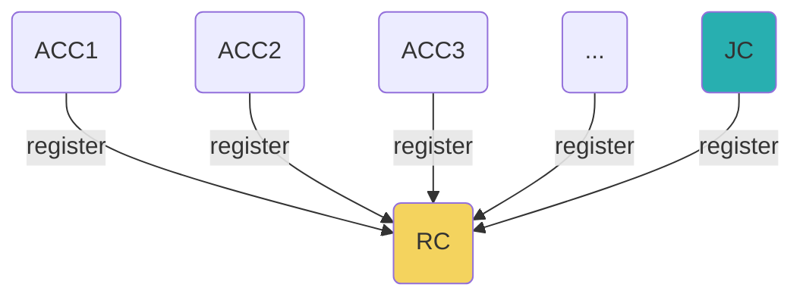
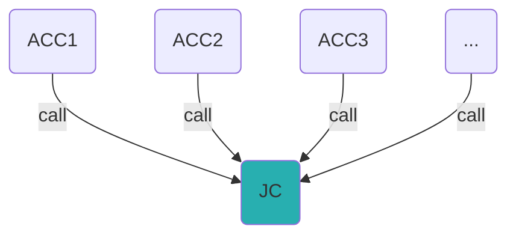

## 论文引文信息（in Chicago）
Zhang, Yuanyu, Shoji Kasahara, Yulong Shen, Xiaohong Jiang, and Jianxiong Wan. "Smart contract-based access control for the internet of things." **IEEE Internet of Things Journal 6, no. 2 (2018)**: 1594-1605.

## 论文分析
### 论文概述
论文设计了三种类型的智能合约用于实现访问控制，分别作用如下：
访问控制合约（ACC）：为每个主客体对创建一个智能合约
仲裁合约（JC）：被ACC实例调用，用于获取对异常行为（i.e.频繁访问）的处罚（i.e.禁止访问时间）
注册合约（RC）：注册ACC和JC的合约地址以及ABI
三个合约之间的对应关系如下：


本文为每个资源都保存了一个异常行为记录，代码中用`mapping[resource]`保存，`BehaviorItem`表示，记录保存内容如下：

| Misbehavior         | Time             | Penalty             |
| ------------------- | ---------------- | ------------------- |
| Too frequent access | 2020-12-16 21:00 | blocked for 2 hours |
| Too frequent access | 2020-12-16 21:30 | blocked for 2 hours |


## 源码分析
```mermaid
classDiagram
class AccessControl {
    +address owner
    +address subject
    +address object
    Judge public jc
    
    struct Misbehavior
    struct BehaviorItem
    struct PolicyItem

    mapping[resource][action] policies
    mapping[resource] behaviors

    +AccessControlMethod(_subject)
    +setJC(_jc)
    +policyAdd(_resource, _action, _permission, _minInterval, _threshold)
    +getPolicy(string _resource, string _action) : (_permission,
    _minInterval, _threshold, _ToLR, _NoFR, _res, _errcode)
    +policyUpdate(string _resource, string _action, string _newPermission)
    +minIntervalUpdate(_resource, _action, _newMinInterval)
    +thresholdUpdate( _resource, _action, _newThreshold)
    +policyDelete(_resource, _action)
    +accessControl(_resource, _action, _time) -> emit
    +getTimeofUnblock(_resource) : (_penalty, _timeOfUnblock)
    +deleteACC()
}
AccessControl o-- Judge
class Judge {
    +uint base
    +uint interval
    +address owner
    struct Misbehavior
    +mapping[subject] MisbehaviorList
    +Judge(_base, _interval)
    +misbehaviorJudge(_subject, _object, _res, _action, _misbehavior, _time) : penalty -> emit
    +getLatestMisbehavior(_key) : (_subject, _object, _res, _action, _misbehavior, _time)
    +self_destruct()
}
class Register{
    struct Method
    +mapping[method] lookupTable
    +methodRegister(_methodName, _scname, _subject, _object, _creator, _scAddress, _abi)
    +methodScNameUpdate(_methodName, _scName)
    +methodAcAddressUpdate(_methodName, _scAddress)
    +methodAbiUpdate(_methodName, _abi)
    +methodNameUpdate(_oldName, _newName)
    +methodDelete(_name)
    +getContractAddr(_methodName) : _scAddressp
    +getContractAbi(_methodName) : _abi
}
```
## 论文源代码
### 智能合约
Access Control Contract, one per subject-object pair

```solidity
pragma solidity ^0.4.0;

contract AccessControlMethod{

    address public owner;
    address public subject;
    address public object;
    Judge public jc;

    event ReturnAccessResult(
     address indexed _from,
     string _errmsg,
     bool _result,
     uint _time,
     uint _penalty
    );
    
    struct Misbehavior{
        string res; //resource on which the misbehavior is conducted
        string action; //action (e.g., "read", "write", "execute") of the misbehavior
        string misbehavior; //misbehavior
        uint time; //time of the misbehavior occured
        uint penalty; //penalty opposed to the subject (number of minutes blocked)
    }

    struct BehaviorItem{ //for one resource
        Misbehavior [] mbs; //misbehavior list of the subject on a particular resource
        uint TimeofUnblock; //time when the resource is unblocked (0 if unblocked; otherwise,blocked)
    }

    struct PolicyItem{ //for one (resource, action) pair;
        bool isValued; //for duplicate check
        string permission; //permission: "allow" or "deny"
        uint minInterval; //minimum allowable interval (in seconds) between two successive requests
        uint ToLR; //Time of Last Request
        uint NoFR; //Number of frequent Requests in a short period of time
        uint threshold; //threshold on NoFR, above which a misbehavior is suspected
        bool result; //last access result
        uint8 err; //last err code
    }

    mapping (bytes32 => mapping(bytes32 => PolicyItem)) policies; //mapping (resource, action) =>PolicyCriteria for policy check
    mapping (bytes32 => BehaviorItem) behaviors; //mapping resource => BehaviorCriteria for behavior check

    /*convert strings to byte32*/
    function stringToBytes32(string _str) public constant returns (bytes32){
        bytes memory tempBytes = bytes(_str);
        bytes32 convertedBytes;
        if(0 == tempBytes.length){
            return 0x0;
        }
        assembly {
            convertedBytes := mload(add(_str, 32))
        }
        return convertedBytes;
    }

    function AccessControlMethod(address _subject) public{
        owner = msg.sender;
        object = msg.sender;
        subject = _subject;
    }

    
    function setJC(address _jc)public{
        if(owner == msg.sender){
            jc = Judge(_jc);
        }
        else throw;
    
    }

    function policyAdd(string _resource, string _action, string _permission, uint _minInterval, uint _threshold) public{
        bytes32 resource = stringToBytes32(_resource);
        bytes32 action = stringToBytes32(_action);
        if(msg.sender == owner){
            if(policies[resource][action].isValued) throw; //duplicated key
            else{
                policies[resource][action].permission = _permission;
                policies[resource][action].minInterval = _minInterval;
                policies[resource][action].threshold = _threshold;
                policies[resource][action].ToLR = 0;
                policies[resource][action].NoFR = 0;
                policies[resource][action].isValued = true;
                policies[resource][action].result = false;
                behaviors[resource].TimeofUnblock = 0;
            }
        }
        else throw;
    }

    function getPolicy(string _resource, string _action) public constant returns (string _permission, uint
    _minInterval, uint _threshold, uint _ToLR, uint _NoFR, bool _res, uint8 _errcode){
        bytes32 resource = stringToBytes32(_resource);
        bytes32 action = stringToBytes32(_action);
        if(policies[resource][action].isValued){
            _permission = policies[resource][action].permission;
            _minInterval = policies[resource][action].minInterval;
            _threshold = policies[resource][action].threshold;
            _NoFR = policies[resource][action].NoFR;
            _ToLR = policies[resource][action].ToLR;
            _res = policies[resource][action].result;
            _errcode = policies[resource][action].err;
        }
        else throw;
    
    }

    function policyUpdate(string _resource, string _action, string _newPermission) public{
        bytes32 resource = stringToBytes32(_resource);
        bytes32 action = stringToBytes32(_action);
        if(policies[resource][action].isValued){
            policies[resource][action].permission = _newPermission;
        }
        else throw;
    }

    function minIntervalUpdate(string _resource, string _action, uint _newMinInterval) public{
        bytes32 resource = stringToBytes32(_resource);
        bytes32 action = stringToBytes32(_action);
        if(policies[resource][action].isValued){
            policies[resource][action].minInterval= _newMinInterval;
        }
        else throw;
    }

    function thresholdUpdate(string _resource, string _action, uint _newThreshold) public{
        bytes32 resource = stringToBytes32(_resource);
        bytes32 action = stringToBytes32(_action);
        
        if(policies[resource][action].isValued){
            policies[resource][action].threshold= _newThreshold;
        }
        else throw;
    }

    function policyDelete(string _resource, string _action) public{
        bytes32 resource = stringToBytes32(_resource);
        bytes32 action = stringToBytes32(_action);
        if(msg.sender == owner){
            if(policies[resource][action].isValued){
                delete policies[resource][action];
            }
            else throw;
        }
        else throw;
    }
    
    /*Use event*/
    function accessControl(string _resource, string _action, uint _time) public{
    
        bool policycheck = false;
        bool behaviorcheck = true;
        uint8 errcode = 0;
        uint penalty = 0;
    
        if (msg.sender == subject){
            bytes32 resource = stringToBytes32(_resource);
            bytes32 action = stringToBytes32(_action);
        
            if(behaviors[resource].TimeofUnblock >= _time){//still blocked state
                errcode = 1; //"Requests are blocked!"
            }
        
            else{//unblocked state
                if(behaviors[resource].TimeofUnblock > 0){
                    behaviors[resource].TimeofUnblock = 0;
                    policies[resource][action].NoFR = 0;
                    policies[resource][action].ToLR = 0;
                }
        //policy check
                if (keccak256("allow") == keccak256(policies[resource][action].permission)){
                    policycheck = true;
                }
                else{
                    policycheck = false;
                }
        //behavior check
                if (_time - policies[resource][action].ToLR <= policies[resource][action].minInterval){
                    policies[resource][action].NoFR++;
                    if(policies[resource][action].NoFR >= policies[resource][action].threshold){
                        penalty = jc.misbehaviorJudge(subject, object, _resource, _action, "Too frequent access!", _time);
                        behaviorcheck = false;
                        behaviors[resource].TimeofUnblock = _time + penalty * 1 minutes;
                        behaviors[resource].mbs.push(Misbehavior(_resource, _action, "Too frequent access!", _time, penalty));//problem occurs when using array
                    }
                }
                else{
                    policies[resource][action].NoFR = 0;
                }
                if(!policycheck && behaviorcheck) errcode = 2; //"Static Check failed!"
                if(policycheck && !behaviorcheck) errcode = 3; //"Misbehavior detected!"
                if(!policycheck && !behaviorcheck) errcode = 4; //"Static check failed! & Misbehavior detected!";
            
            }
                policies[resource][action].ToLR = _time;
        }
        else {
            errcode = 5; //"Wrong object or subject detected!";
        }
        policies[resource][action].result = policycheck && behaviorcheck;
        policies[resource][action].err = errcode;
        if(0 == errcode) ReturnAccessResult(msg.sender, "Access authorized!", true, _time, penalty);
        if(1 == errcode) ReturnAccessResult(msg.sender, "Requests are blocked!", false, _time, penalty);
        if(2 == errcode) ReturnAccessResult(msg.sender, "Static Check failed!", false, _time, penalty);
        if(3 == errcode) ReturnAccessResult(msg.sender, "Misbehavior detected!", false, _time, penalty);
        if(4 == errcode) ReturnAccessResult(msg.sender, "Static check failed! & Misbehavior detected!",
        false, _time, penalty);
        if(5 == errcode) ReturnAccessResult(msg.sender, "Wrong object or subject specified!", false, _time,
        penalty);
    }


    function getTimeofUnblock(string _resource) public constant returns(uint _penalty, uint
    _timeOfUnblock){
        bytes32 resource= stringToBytes32(_resource);
        _timeOfUnblock = behaviors[resource].TimeofUnblock;
        uint l = behaviors[resource].mbs.length;
        _penalty = behaviors[resource].mbs[l - 1].penalty;
    }


    function deleteACC() public{
        if(msg.sender == owner){
            selfdestruct(this);
        }
    }
}


contract Judge{
    function misbehaviorJudge(address _subject, address _object, string _res, string _action, string
    _misbehavior, uint _time) public returns (uint );
}
```


Judge Contract, called by ACC(s) to judge the misbehavior of subjects and return the corresponding penalty

```solidity
  pragma solidity ^0.4.0;

  contract Judge{
    uint public base;
    uint public interval;
    address public owner;
    event isCalled(address _from, uint _time, uint _penalty);

    struct Misbehavior{
        address subject; //subject who performed the misbehavior;
        address object; //
        string res; //
        string action; //action (e.g., "read", "write", "execute") of the misbehavior
        string misbehavior; //misbehavior
        uint time; //time of the Misbehavior occured
        uint penalty; //penalty (number of minitues blocked);
    }

    mapping (address => Misbehavior[]) public MisbehaviorList;

    function Judge (uint _base, uint _interval) public{
        base = _base;
        interval = _interval;
        owner = msg.sender;
    }

    function misbehaviorJudge(address _subject, address _object, string _res, string _action, string
    _misbehavior, uint _time) public returns (uint penalty){
        //misbehaviorJudge(msb);
        uint length = MisbehaviorList[_subject].length + 1;
        uint n = length/interval;
        penalty = base**n;
        MisbehaviorList[_subject].push(Misbehavior(_subject, _object, _res, _action, _misbehavior, _time, penalty));
        isCalled(msg.sender,_time, penalty);
    }

    function getLatestMisbehavior(address _key) public constant returns (address _subject, address _object, string _res, string _action, string _misbehavior, uint _time){
        uint latest = MisbehaviorList[_key].length - 1;
        //uint latest = 0;
        _subject = MisbehaviorList[_key][latest].subject;
        _object = MisbehaviorList[_key][latest].object;
        _res = MisbehaviorList[_key][latest].res;
        _action = MisbehaviorList[_key][latest].action;
        _misbehavior = MisbehaviorList[_key][latest].misbehavior;
        _time = MisbehaviorList[_key][latest].time;
    }

    function self_destruct() public{
        if(msg.sender == owner){
        selfdestruct(this);
        }
    }
}
```


Register Contract, registering required information, such contract address and ABI for interacting with the ACCs and JC

```solidity
pragma solidity ^0.4.0;

contract Register{
    struct Method{
        string scName; //contract name
        address subject; //the subject of the corresponding subject-object pair of the ACC; for the JC, this filed is left blank;
        address object; //the subject of the corresponding subject-object pair of the ACC; for the JC, this filed is left blank;
        address creator; //the peer (account) who created and deployed this contract;
        address scAddress; //the address of the contract;
        bytes abi; //the Abifs provided by the contract.
    }

     /*As solidity cannot allow dynamically-sized value as the Key, we use the fixed-szie byte32 type as the keytype*/
    mapping (bytes32=> Method) public lookupTable;

    /*convert strings to byte32*/
    function stringToBytes32(string _str) public constant returns (bytes32){
            bytes memory tempBytes = bytes(_str);
            bytes32 convertedBytes;
            if(0 == tempBytes.length){
            return 0x0;
        }
        assembly {
        convertedBytes := mload(add(_str, 32))
        }
        return convertedBytes;
    }

 /*register an access control contract (ACC)*/
    function methodRegister(string _methodName, string _scname, address _subject, address _object, address
    _creator, address _scAddress, bytes _abi) public {
    //no duplicate check
        bytes32 newKey = stringToBytes32(_methodName);
        lookupTable[newKey].scName = _scname;
        lookupTable[newKey].subject = _subject;
        lookupTable[newKey].object = _object;
        lookupTable[newKey].creator = _creator;
        lookupTable[newKey].scAddress = _scAddress;
        lookupTable[newKey].abi = _abi;
    }

 /*update the ACC information (i.e., scname, scAddress, abi) of an exisiting method specified by the
_methodName*/
    function methodScNameUpdate(string _methodName, string _scName) public{
        bytes32 key = stringToBytes32(_methodName);
        lookupTable[key].scName = _scName;
    }

    function methodAcAddressUpdate(string _methodName, address _scAddress) public{
        bytes32 key = stringToBytes32(_methodName);
        lookupTable[key].scAddress = _scAddress;
    }

    function methodAbiUpdate(string _methodName, bytes _abi) public{
        bytes32 key = stringToBytes32(_methodName);
        lookupTable[key].abi = _abi;
    }

    /*update the name (_oldname) of an exisiting method with a new name (_newname) */
    function methodNameUpdate(string _oldName, string _newName) public{
        bytes32 oldKey = stringToBytes32(_oldName);
        bytes32 newKey = stringToBytes32(_newName);
        lookupTable[newKey].scName = lookupTable[oldKey].scName;
        lookupTable[newKey].subject = lookupTable[oldKey].subject;
        lookupTable[newKey].object = lookupTable[oldKey].object;
        lookupTable[newKey].creator = lookupTable[oldKey].creator;
        lookupTable[newKey].scAddress = lookupTable[oldKey].scAddress;
        lookupTable[newKey].abi = lookupTable[oldKey].abi;
        delete lookupTable[oldKey];
    }
    
    function methodDelete(string _name) public{
        delete lookupTable[stringToBytes32(_name)];
    }

    function getContractAddr(string _methodName) public constant returns (address _scAddress){
        bytes32 key = stringToBytes32(_methodName);
        _scAddress = lookupTable[key].scAddress;
    }
    
    function getContractAbi(string _methodName) public constant returns (bytes _abi){
        bytes32 key = stringToBytes32(_methodName);
        _abi = lookupTable[key].abi;
    }
}
```


### JavaScript
Registering an ACC in the JC

```javascript
var Web3 = require('web3');
var web3 = new Web3(new Web3.providers.HttpProvider("http://localhost:8545"));
var regAddr = "0xddf27a729d05be6f11be50b1905daa6e7b508c91";
var regAbi = [
	{
		"constant": true,
		"inputs": [
			{
				"name": "_str",
				"type": "string"
			}
		],
		"name": "stringToBytes32",
		"outputs": [
			{
				"name": "",
				"type": "bytes32"
			}
		],
		"payable": false,
		"stateMutability": "view",
		"type": "function"
	},
	{
		"constant": true,
		"inputs": [
			{
				"name": "",
				"type": "bytes32"
			}
		],
		"name": "lookupTable",
		"outputs": [
			{
				"name": "scName",
				"type": "string"
			},
			{
				"name": "subject",
				"type": "address"
			},
			{
				"name": "object",
				"type": "address"
			},
			{
				"name": "creator",
				"type": "address"
			},
			{
				"name": "scAddress",
				"type": "address"
			},
			{
				"name": "abi",
				"type": "bytes"
			}
		],
		"payable": false,
		"stateMutability": "view",
		"type": "function"
	},
	{
		"constant": true,
		"inputs": [
			{
				"name": "_methodName",
				"type": "string"
			}
		],
		"name": "getContractAddr",
		"outputs": [
			{
				"name": "_scAddress",
				"type": "address"
			}
		],
		"payable": false,
		"stateMutability": "view",
		"type": "function"
	},
	{
		"constant": true,
		"inputs": [
			{
				"name": "_methodName",
				"type": "string"
			}
		],
		"name": "getContractAbi",
		"outputs": [
			{
				"name": "_abi",
				"type": "bytes"
			}
		],
		"payable": false,
		"stateMutability": "view",
		"type": "function"
	},
	{
		"constant": false,
		"inputs": [
			{
				"name": "_methodName",
				"type": "string"
			},
			{
				"name": "_abi",
				"type": "bytes"
			}
		],
		"name": "methodAbiUpdate",
		"outputs": [],
		"payable": false,
		"stateMutability": "nonpayable",
		"type": "function"
	},
	{
		"constant": false,
		"inputs": [
			{
				"name": "_methodName",
				"type": "string"
			},
			{
				"name": "_scAddress",
				"type": "address"
			}
		],
		"name": "methodAcAddressUpdate",
		"outputs": [],
		"payable": false,
		"stateMutability": "nonpayable",
		"type": "function"
	},
	{
		"constant": false,
		"inputs": [
			{
				"name": "_name",
				"type": "string"
			}
		],
		"name": "methodDelete",
		"outputs": [],
		"payable": false,
		"stateMutability": "nonpayable",
		"type": "function"
	},
	{
		"constant": false,
		"inputs": [
			{
				"name": "_oldName",
				"type": "string"
			},
			{
				"name": "_newName",
				"type": "string"
			}
		],
		"name": "methodNameUpdate",
		"outputs": [],
		"payable": false,
		"stateMutability": "nonpayable",
		"type": "function"
	},
	{
		"constant": false,
		"inputs": [
			{
				"name": "_methodName",
				"type": "string"
			},
			{
				"name": "_scname",
				"type": "string"
			},
			{
				"name": "_subject",
				"type": "address"
			},
			{
				"name": "_object",
				"type": "address"
			},
			{
				"name": "_creator",
				"type": "address"
			},
			{
				"name": "_scAddress",
				"type": "address"
			},
			{
				"name": "_abi",
				"type": "bytes"
			}
		],
		"name": "methodRegister",
		"outputs": [],
		"payable": false,
		"stateMutability": "nonpayable",
		"type": "function"
	},
	{
		"constant": false,
		"inputs": [
			{
				"name": "_methodName",
				"type": "string"
			},
			{
				"name": "_scName",
				"type": "string"
			}
		],
		"name": "methodScNameUpdate",
		"outputs": [],
		"payable": false,
		"stateMutability": "nonpayable",
		"type": "function"
	}
]
var methodName = "Method1";
var register = web3.eth.contract(regAbi).at(regAddr);
var accAddr = register.getContractAddr(methodName);
var accAbiBytes = register.getContractAbi(methodName);
var accAbi = JSON.parse(web3.toAscii(accAbiBytes));
var myACC = web3.eth.contract(accAbi).at(accAddr);
var myEvent = myACC.ReturnAccessResult({fromBlock: 0, toBlock: 'latest'});
myEvent.watch(function(err, result){
  if(!err){
		//console.log(result);
		console.log("Contract: "+result.address);
		console.log("Block Number: " + result.blockNumber);
		console.log("Tx Hash: " + result.transactionHash);
		console.log("Block Hash: "+ result.blockHash);
		console.log("Subject: "+ result.args._from);
		console.log("Time: " + result.args._time.toNumber());
		console.log("Message: " + result.args._errmsg);
		console.log("Result: " + result.args._result);
		if (result.args._penalty > 0)
			console.log("Requests are blocked for " + result.args._penalty + " minutes!");
    console.log("\n");
	}
})
```


Retrieving the required information of an ACC and sending access reqeusts to this ACC for access control

```javascript
var Web3 = require('web3');
var web3 = new Web3(new Web3.providers.HttpProvider("http://localhost:8545"));

var subject = "0x0d1f8a489b1312689f11f7fe79dfc3b61ffa4160";
var regAddr = "0xddf27a729d05be6f11be50b1905daa6e7b508c91";
var regAbi = [
	{
		"constant": true,
		"inputs": [
			{
				"name": "_str",
				"type": "string"
			}
		],
		"name": "stringToBytes32",
		"outputs": [
			{
				"name": "",
				"type": "bytes32"
			}
		],
		"payable": false,
		"stateMutability": "view",
		"type": "function"
	},
	{
		"constant": true,
		"inputs": [
			{
				"name": "",
				"type": "bytes32"
			}
		],
		"name": "lookupTable",
		"outputs": [
			{
				"name": "scName",
				"type": "string"
			},
			{
				"name": "subject",
				"type": "address"
			},
			{
				"name": "object",
				"type": "address"
			},
			{
				"name": "creator",
				"type": "address"
			},
			{
				"name": "scAddress",
				"type": "address"
			},
			{
				"name": "abi",
				"type": "bytes"
			}
		],
		"payable": false,
		"stateMutability": "view",
		"type": "function"
	},
	{
		"constant": true,
		"inputs": [
			{
				"name": "_methodName",
				"type": "string"
			}
		],
		"name": "getContractAddr",
		"outputs": [
			{
				"name": "_scAddress",
				"type": "address"
			}
		],
		"payable": false,
		"stateMutability": "view",
		"type": "function"
	},
	{
		"constant": true,
		"inputs": [
			{
				"name": "_methodName",
				"type": "string"
			}
		],
		"name": "getContractAbi",
		"outputs": [
			{
				"name": "_abi",
				"type": "bytes"
			}
		],
		"payable": false,
		"stateMutability": "view",
		"type": "function"
	},
	{
		"constant": false,
		"inputs": [
			{
				"name": "_methodName",
				"type": "string"
			},
			{
				"name": "_abi",
				"type": "bytes"
			}
		],
		"name": "methodAbiUpdate",
		"outputs": [],
		"payable": false,
		"stateMutability": "nonpayable",
		"type": "function"
	},
	{
		"constant": false,
		"inputs": [
			{
				"name": "_methodName",
				"type": "string"
			},
			{
				"name": "_scAddress",
				"type": "address"
			}
		],
		"name": "methodAcAddressUpdate",
		"outputs": [],
		"payable": false,
		"stateMutability": "nonpayable",
		"type": "function"
	},
	{
		"constant": false,
		"inputs": [
			{
				"name": "_name",
				"type": "string"
			}
		],
		"name": "methodDelete",
		"outputs": [],
		"payable": false,
		"stateMutability": "nonpayable",
		"type": "function"
	},
	{
		"constant": false,
		"inputs": [
			{
				"name": "_oldName",
				"type": "string"
			},
			{
				"name": "_newName",
				"type": "string"
			}
		],
		"name": "methodNameUpdate",
		"outputs": [],
		"payable": false,
		"stateMutability": "nonpayable",
		"type": "function"
	},
	{
		"constant": false,
		"inputs": [
			{
				"name": "_methodName",
				"type": "string"
			},
			{
				"name": "_scname",
				"type": "string"
			},
			{
				"name": "_subject",
				"type": "address"
			},
			{
				"name": "_object",
				"type": "address"
			},
			{
				"name": "_creator",
				"type": "address"
			},
			{
				"name": "_scAddress",
				"type": "address"
			},
			{
				"name": "_abi",
				"type": "bytes"
			}
		],
		"name": "methodRegister",
		"outputs": [],
		"payable": false,
		"stateMutability": "nonpayable",
		"type": "function"
	},
	{
		"constant": false,
		"inputs": [
			{
				"name": "_methodName",
				"type": "string"
			},
			{
				"name": "_scName",
				"type": "string"
			}
		],
		"name": "methodScNameUpdate",
		"outputs": [],
		"payable": false,
		"stateMutability": "nonpayable",
		"type": "function"
	}
];


var methodName = "Method1";
var register = web3.eth.contract(regAbi).at(regAddr);
var accAddr = register.getContractAddr(methodName);
var accAbiBytes = register.getContractAbi(methodName);
var accAbi = JSON.parse(web3.toAscii(accAbiBytes));
var myACC = web3.eth.contract(accAbi).at(accAddr);

var myEvent = myACC.ReturnAccessResult({_from: subject},{from: 'latest'});
var previousTxHash = 0;
var currentTxHash = 0;
const readline = require('readline');
const rl = readline.createInterface({
  input: process.stdin,
  output: process.stdout
});

rl.setPrompt('Send access request?(y/n)');
rl.prompt();

rl.on('line',  (answer) => {
	if('y' == answer) {
		var currentTime = new Date().getTime()/1000;
		currentTxHash = myACC.accessControl.sendTransaction("File A", "write", currentTime, {from: web3.eth.accounts[0]});

		myEvent.watch(function(err, result){
			if(!err){
				if(previousTxHash != result.transactionHash && currentTxHash == result.transactionHash){//avoid dupicate event captured
  					 console.log("Contract: "+result.address);
					 console.log("Block Number: " + result.blockNumber);
               				 console.log("Tx Hash: " + result.transactionHash);
                			 console.log("Block Hash: "+ result.blockHash);
                                         console.log("Time: " + result.args._time.toNumber());
                			 console.log("Message: " + result.args._errmsg);
                			 console.log("Result: " + result.args._result);
                                         if (result.args._penalty > 0)
                       				 console.log("Requests are blocked for " + result.args._penalty + " minutes!");
   					 console.log('\n');
					 previousTxHash = result.transactionHash;
					 rl.prompt();
				}
			}
		});
	}
	else{
		console.log("Ummmmm....");
		rl.prompt();
	}
});

rl.on('close', function() {
		console.log('Have a great day!');
    process.exit(0);
});
```


Called by an object to watch the deployed ACC and retrive the access result when an access reqeust comes

```javascript
var Web3 = require('web3');
var web3 = new Web3(new Web3.providers.HttpProvider("http://localhost:8545"));

var regAddr = "0xddf27a729d05be6f11be50b1905daa6e7b508c91";

var regAbi = [
	{
		"constant": true,
		"inputs": [
			{
				"name": "_str",
				"type": "string"
			}
		],
		"name": "stringToBytes32",
		"outputs": [
			{
				"name": "",
				"type": "bytes32"
			}
		],
		"payable": false,
		"stateMutability": "view",
		"type": "function"
	},
	{
		"constant": true,
		"inputs": [
			{
				"name": "",
				"type": "bytes32"
			}
		],
		"name": "lookupTable",
		"outputs": [
			{
				"name": "scName",
				"type": "string"
			},
			{
				"name": "subject",
				"type": "address"
			},
			{
				"name": "object",
				"type": "address"
			},
			{
				"name": "creator",
				"type": "address"
			},
			{
				"name": "scAddress",
				"type": "address"
			},
			{
				"name": "abi",
				"type": "bytes"
			}
		],
		"payable": false,
		"stateMutability": "view",
		"type": "function"
	},
	{
		"constant": true,
		"inputs": [
			{
				"name": "_methodName",
				"type": "string"
			}
		],
		"name": "getContractAddr",
		"outputs": [
			{
				"name": "_scAddress",
				"type": "address"
			}
		],
		"payable": false,
		"stateMutability": "view",
		"type": "function"
	},
	{
		"constant": true,
		"inputs": [
			{
				"name": "_methodName",
				"type": "string"
			}
		],
		"name": "getContractAbi",
		"outputs": [
			{
				"name": "_abi",
				"type": "bytes"
			}
		],
		"payable": false,
		"stateMutability": "view",
		"type": "function"
	},
	{
		"constant": false,
		"inputs": [
			{
				"name": "_methodName",
				"type": "string"
			},
			{
				"name": "_abi",
				"type": "bytes"
			}
		],
		"name": "methodAbiUpdate",
		"outputs": [],
		"payable": false,
		"stateMutability": "nonpayable",
		"type": "function"
	},
	{
		"constant": false,
		"inputs": [
			{
				"name": "_methodName",
				"type": "string"
			},
			{
				"name": "_scAddress",
				"type": "address"
			}
		],
		"name": "methodAcAddressUpdate",
		"outputs": [],
		"payable": false,
		"stateMutability": "nonpayable",
		"type": "function"
	},
	{
		"constant": false,
		"inputs": [
			{
				"name": "_name",
				"type": "string"
			}
		],
		"name": "methodDelete",
		"outputs": [],
		"payable": false,
		"stateMutability": "nonpayable",
		"type": "function"
	},
	{
		"constant": false,
		"inputs": [
			{
				"name": "_oldName",
				"type": "string"
			},
			{
				"name": "_newName",
				"type": "string"
			}
		],
		"name": "methodNameUpdate",
		"outputs": [],
		"payable": false,
		"stateMutability": "nonpayable",
		"type": "function"
	},
	{
		"constant": false,
		"inputs": [
			{
				"name": "_methodName",
				"type": "string"
			},
			{
				"name": "_scname",
				"type": "string"
			},
			{
				"name": "_subject",
				"type": "address"
			},
			{
				"name": "_object",
				"type": "address"
			},
			{
				"name": "_creator",
				"type": "address"
			},
			{
				"name": "_scAddress",
				"type": "address"
			},
			{
				"name": "_abi",
				"type": "bytes"
			}
		],
		"name": "methodRegister",
		"outputs": [],
		"payable": false,
		"stateMutability": "nonpayable",
		"type": "function"
	},
	{
		"constant": false,
		"inputs": [
			{
				"name": "_methodName",
				"type": "string"
			},
			{
				"name": "_scName",
				"type": "string"
			}
		],
		"name": "methodScNameUpdate",
		"outputs": [],
		"payable": false,
		"stateMutability": "nonpayable",
		"type": "function"
	}
];

var register = web3.eth.contract(regAbi).at(regAddr);
var _methodName = "1";
var _scName = "2";
var _subject = "0x0d1f8a489b1312689f11f7fe79dfc3b61ffa4160";
var _object = "0x0d1f8a489b1312689f11f7fe79dfc3b61ffa4160";
var _creator = "0x0d1f8a489b1312689f11f7fe79dfc3b61ffa4160";
var _scAddr = "0x0d1f8a489b1312689f11f7fe79dfc3b61ffa4160";
var _abi = [
	{
		"constant": true,
		"inputs": [],
		"name": "subject",
		"outputs": [
			{
				"name": "",
				"type": "address"
			}
		],
		"payable": false,
		"stateMutability": "view",
		"type": "function"
	},
	{
		"constant": true,
		"inputs": [],
		"name": "object",
		"outputs": [
			{
				"name": "",
				"type": "address"
			}
		],
		"payable": false,
		"stateMutability": "view",
		"type": "function"
	},
	{
		"constant": false,
		"inputs": [
			{
				"name": "_jc",
				"type": "address"
			}
		],
		"name": "setJC",
		"outputs": [],
		"payable": false,
		"stateMutability": "nonpayable",
		"type": "function"
	},
	{
		"constant": true,
		"inputs": [
			{
				"name": "_resource",
				"type": "string"
			},
			{
				"name": "_action",
				"type": "string"
			}
		],
		"name": "getPolicy",
		"outputs": [
			{
				"name": "_permission",
				"type": "string"
			},
			{
				"name": "_minInterval",
				"type": "uint256"
			},
			{
				"name": "_threshold",
				"type": "uint256"
			},
			{
				"name": "_ToLR",
				"type": "uint256"
			},
			{
				"name": "_NoFR",
				"type": "uint256"
			},
			{
				"name": "_res",
				"type": "bool"
			},
			{
				"name": "_errcode",
				"type": "uint8"
			}
		],
		"payable": false,
		"stateMutability": "view",
		"type": "function"
	},
	{
		"constant": true,
		"inputs": [],
		"name": "jc",
		"outputs": [
			{
				"name": "",
				"type": "address"
			}
		],
		"payable": false,
		"stateMutability": "view",
		"type": "function"
	},
	{
		"constant": false,
		"inputs": [
			{
				"name": "_resource",
				"type": "string"
			},
			{
				"name": "_action",
				"type": "string"
			}
		],
		"name": "policyDelete",
		"outputs": [],
		"payable": false,
		"stateMutability": "nonpayable",
		"type": "function"
	},
	{
		"constant": true,
		"inputs": [],
		"name": "owner",
		"outputs": [
			{
				"name": "",
				"type": "address"
			}
		],
		"payable": false,
		"stateMutability": "view",
		"type": "function"
	},
	{
		"constant": false,
		"inputs": [
			{
				"name": "_resource",
				"type": "string"
			},
			{
				"name": "_action",
				"type": "string"
			},
			{
				"name": "_newThreshold",
				"type": "uint256"
			}
		],
		"name": "thresholdUpdate",
		"outputs": [],
		"payable": false,
		"stateMutability": "nonpayable",
		"type": "function"
	},
	{
		"constant": true,
		"inputs": [
			{
				"name": "_resource",
				"type": "string"
			}
		],
		"name": "getTimeofUnblock",
		"outputs": [
			{
				"name": "_penalty",
				"type": "uint256"
			},
			{
				"name": "_timeOfUnblock",
				"type": "uint256"
			}
		],
		"payable": false,
		"stateMutability": "view",
		"type": "function"
	},
	{
		"constant": false,
		"inputs": [
			{
				"name": "_resource",
				"type": "string"
			},
			{
				"name": "_action",
				"type": "string"
			},
			{
				"name": "_permission",
				"type": "string"
			},
			{
				"name": "_minInterval",
				"type": "uint256"
			},
			{
				"name": "_threshold",
				"type": "uint256"
			}
		],
		"name": "policyAdd",
		"outputs": [],
		"payable": false,
		"stateMutability": "nonpayable",
		"type": "function"
	},
	{
		"constant": false,
		"inputs": [
			{
				"name": "_resource",
				"type": "string"
			},
			{
				"name": "_action",
				"type": "string"
			},
			{
				"name": "_newMinInterval",
				"type": "uint256"
			}
		],
		"name": "minIntervalUpdate",
		"outputs": [],
		"payable": false,
		"stateMutability": "nonpayable",
		"type": "function"
	},
	{
		"constant": false,
		"inputs": [
			{
				"name": "_resource",
				"type": "string"
			},
			{
				"name": "_action",
				"type": "string"
			},
			{
				"name": "_time",
				"type": "uint256"
			}
		],
		"name": "accessControl",
		"outputs": [],
		"payable": false,
		"stateMutability": "nonpayable",
		"type": "function"
	},
	{
		"constant": true,
		"inputs": [
			{
				"name": "_str",
				"type": "string"
			}
		],
		"name": "stringToBytes32",
		"outputs": [
			{
				"name": "",
				"type": "bytes32"
			}
		],
		"payable": false,
		"stateMutability": "view",
		"type": "function"
	},
	{
		"constant": false,
		"inputs": [
			{
				"name": "_resource",
				"type": "string"
			},
			{
				"name": "_action",
				"type": "string"
			},
			{
				"name": "_newPermission",
				"type": "string"
			}
		],
		"name": "policyUpdate",
		"outputs": [],
		"payable": false,
		"stateMutability": "nonpayable",
		"type": "function"
	},
	{
		"constant": false,
		"inputs": [],
		"name": "deleteACC",
		"outputs": [],
		"payable": false,
		"stateMutability": "nonpayable",
		"type": "function"
	},
	{
		"inputs": [
			{
				"name": "_subject",
				"type": "address"
			}
		],
		"payable": false,
		"stateMutability": "nonpayable",
		"type": "constructor"
	},
	{
		"anonymous": false,
		"inputs": [
			{
				"indexed": true,
				"name": "_from",
				"type": "address"
			},
			{
				"indexed": false,
				"name": "_errmsg",
				"type": "string"
			},
			{
				"indexed": false,
				"name": "_result",
				"type": "bool"
			},
			{
				"indexed": false,
				"name": "_time",
				"type": "uint256"
			},
			{
				"indexed": false,
				"name": "_penalty",
				"type": "uint256"
			}
		],
		"name": "ReturnAccessResult",
		"type": "event"
	}
]

register.methodRegister.sendTransaction(_methodName, _scName, _subject, _object, _creator, _scAddr, _abi, {from:web3.eth.coinbase, gas:3000000});
```


## 参考文献
[1] [源代码GitHub仓库](https://github.com/yy90zhang/access-control)
[2] [论文链接](https://ieeexplore.ieee.org/abstract/document/8386853)
